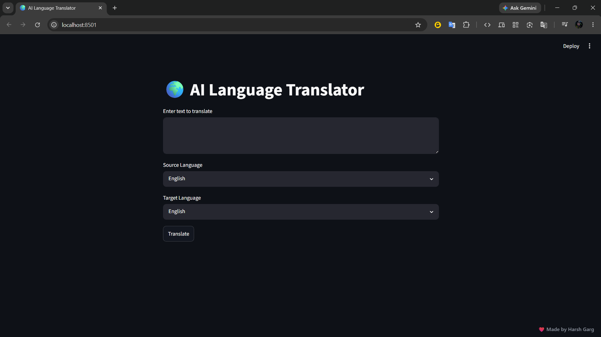

# 🌍 AI Language Translator

A simple and interactive language translation web application built using **Python**, **Streamlit**, and **Deep Translator**. This project allows users to translate text between multiple languages through an easy-to-use interface.

---

## 📖 Overview

The AI Language Translator is designed to help users translate text quickly and accurately between different languages. Users can enter text, choose the source and target languages, and receive the translated output instantly.

This project was developed as part of the **CodeAlpha Artificial Intelligence Internship** to demonstrate the practical use of Python libraries and web application development.

---

## ✨ Features

- 🌐 Translate text between multiple languages
- 📝 Simple and user-friendly interface
- ⚡ Fast and accurate translation
- 🎯 Easy language selection
- 💻 Built entirely with Python

---

## 🛠️ Technologies Used

- Python
- Streamlit
- Deep Translator

---

## 📂 Project Structure

```text
ai-language-translator/
│
├── app.py
├── requirements.txt
├── README.md
├── .gitignore
└── screenshots/
    └── app.png
```

---

## 🚀 Installation

### 1. Clone the repository

```bash
git clone https://github.com/vortex-001/ai-language-translator.git
```

### 2. Navigate to the project directory

```bash
cd ai-language-translator
```

### 3. Install the required dependencies

```bash
pip install -r requirements.txt
```

### 4. Run the application

```bash
streamlit run app.py
```

The application will open automatically in your default web browser.

---

## 📸 Screenshot




---

## 🎯 Future Improvements

- Voice input support
- Text-to-Speech
- Translation history
- Auto language detection
- Download translated text
- Copy translated text with one click

---

## 📚 What I Learned

While working on this project, I learned:

- Building web applications using Streamlit
- Using third-party Python libraries
- Handling user input and displaying dynamic output
- Creating a clean and interactive user interface
- Managing a project using Git and GitHub

---

## 👨‍💻 Author

**Harsh Garg**

B.Tech Computer Science Engineering

GitHub: https://github.com/vortex-001

---

